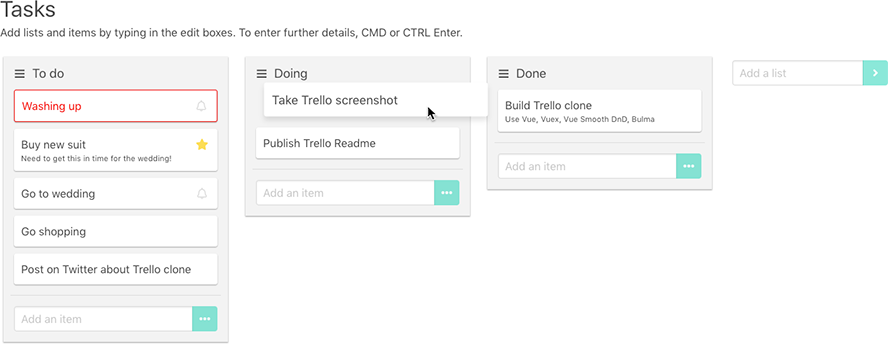

# Vue Trello Clone

A simple Trello clone in Vue, Vuex and Bulma




## Features

Trello features

- Single board
- Re-orderable lists and tasks

Task functionality

- Title, description, date
- Quick entry and full entry modal
- Icons and colors to indicate due and overdue items
- Editable tasks

UI features

- Fast keyboard interaction
- Smooth animation

State management

- Vuex state management
- Persistence


## Setup

``` bash
# install dependencies
npm install

# serve with hot reload at localhost:8080
npm run dev

# build for production with minification
npm run build

# build for production and view the bundle analyzer report
npm run build --report

# run unit tests
npm run unit
npm run unit:watch

# run all tests
npm test
```

## Quick start

Once running in the browser, you can execute the following in the console to create the above layout:

```js
function days (num) { return new Date(Date.now() + (1000 * 60 * 60 * 24 * num)) }
store.dispatch('setLists', [ { title:'To do', items:[ { title:'Washing up', date:days(-5) }, { title:'Buy new suit', description:'Need to get this in time for the wedding!', date:days(2) }, { title:'Go to wedding', description:'', date:days(10) }, { title:'Go shopping' }, { title:'Post on Twitter about Trello clone' } ] }, { title:'Doing', items:[ { title:'Take Trello screenshot' }, { title:'Publish Trello readme' } ] }, { title:'Done', items:[ { title:'Build Trello clone', description:'Use Vue, Vuex, Vue Smooth Dnd and Bulma' } ] } ])
```
